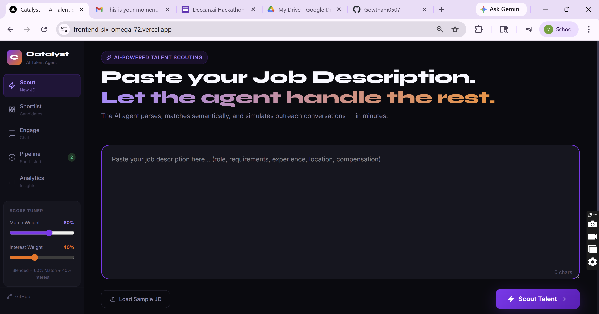
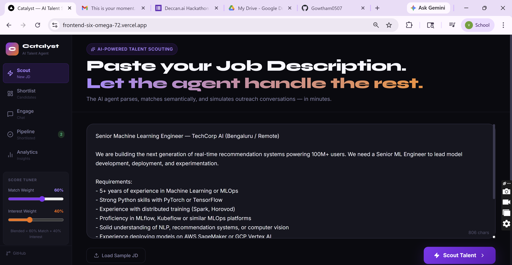
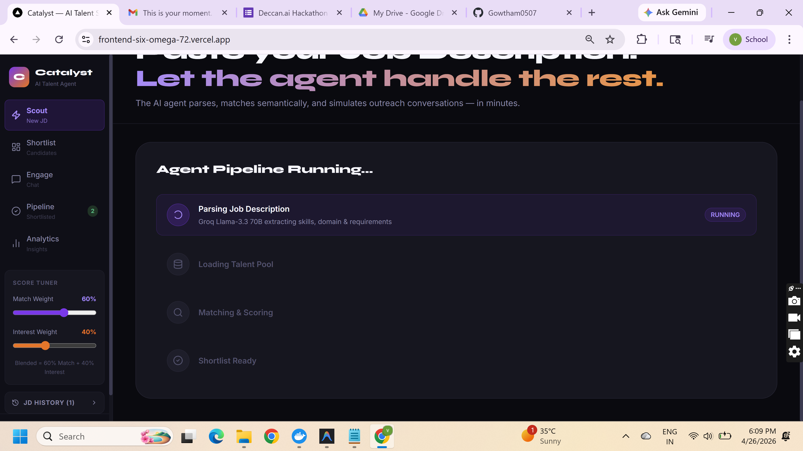
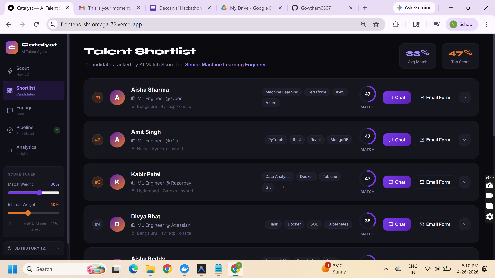
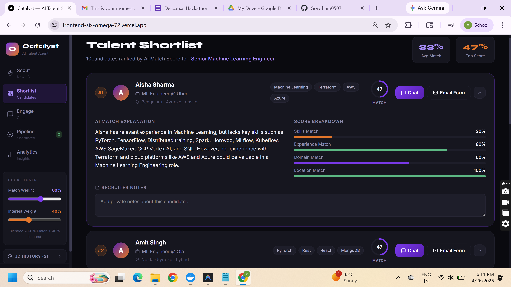
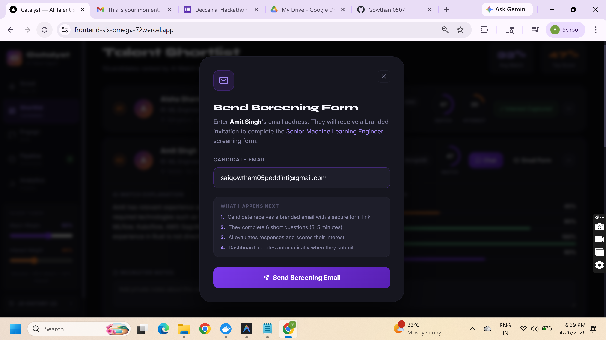
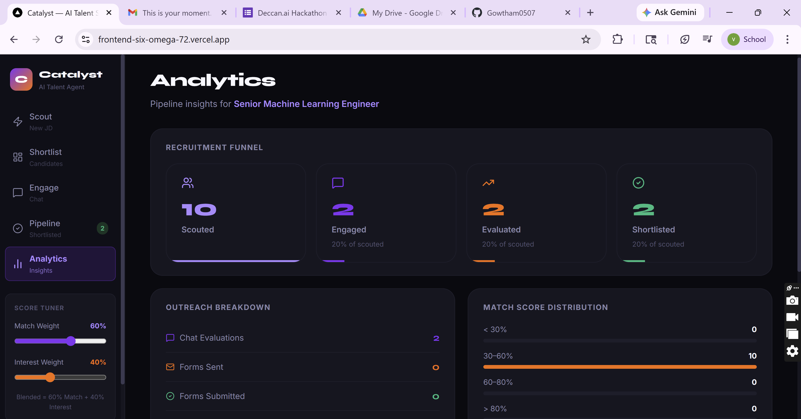
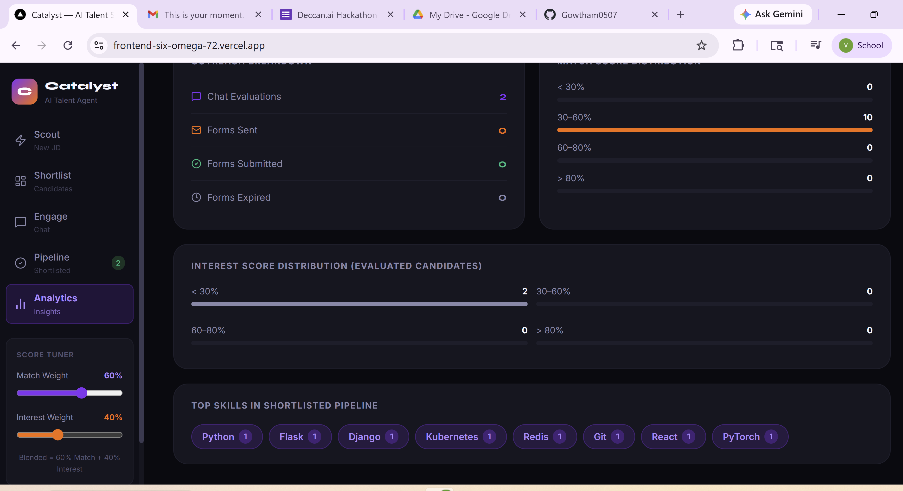

# Catalyst Talent Platform
**AI-Powered Talent Scouting & Engagement Agent**

## Executive Summary

Catalyst is an autonomous, AI-powered talent scouting and engagement platform designed to streamline the recruitment lifecycle. Traditional recruitment processes suffer from high latency, manual repetition, and inefficient candidate screening. Catalyst solves this by automating the initial phases of the hiring funnel: parsing job descriptions, evaluating a talent pool, and executing initial candidate outreach and screening.

By leveraging modern language models, mathematical vector search, and asynchronous real-time user interfaces, Catalyst acts as a complete AI agent. It is capable of making independent outreach decisions, gathering structured candidate data via automated emails, and scoring candidate interest and technical fit to present human recruiters with a finalized, highly qualified shortlist.

## System Architecture and Workflows

The application is built on a decoupled architecture, separating the client-side interface (React/Next.js) from the intensive AI and data processing backend (Python/FastAPI).

### 1. Job Description Parsing
The workflow begins when a recruiter provides a raw, unstructured job description. Catalyst utilizes a Large Language Model (LLM) to extract critical requirements. The AI structures this data into strict JSON, isolating the target role, mandatory technical skills, required years of experience, and location preferences. This structured data becomes the foundational query for the matching engine.

### 2. Candidate Matching and Scoring
Once the job requirements are parsed, the system scans the candidate database. Catalyst employs a custom mathematical search engine (TF-IDF and Cosine Similarity) to calculate a strict "Match Score" between the job description and every candidate profile. The top candidates are then passed through a secondary LLM evaluation layer that generates a human-readable justification for the match score, breaking down exactly why the candidate is a strong fit.

### 3. The Outreach Pipeline
The platform's standout feature is its autonomous outreach capability. When a recruiter approves a candidate, Catalyst generates a personalized, branded email using the Resend API. This email contains a unique, secure, session-based link that directs the candidate to a Catalyst screening form.

### 4. Candidate Evaluation
When the candidate completes the screening form, the responses are instantly analyzed by the AI evaluator. The system scores the candidate's interest level, evaluates their salary expectations and notice period, and generates a "Blended Score" (combining the technical match and behavioral interest). Finally, it outputs a definitive recommendation (Proceed, Consider, or Reject).

## Technical Innovations

Beyond standard CRUD operations, Catalyst incorporates several advanced, custom-built features to handle the complexity of an autonomous recruitment agent.

- **Custom In-Memory Vector Search:** Instead of relying on heavy, latency-prone external vector databases, Catalyst utilizes a custom TF-IDF and Cosine Similarity engine built entirely on Scikit-Learn. By transforming candidate data into mathematical vectors completely in-memory, the system guarantees zero-latency search results.
- **Production Email Dispatching and Form Tracking:** Catalyst moves beyond simulated "mock" environments by integrating a full production email pipeline via the Resend API. It dispatches actual HTML emails to candidate inboxes containing routing links that direct candidates to a secure screening form hosted on the frontend.
- **Asynchronous State Synchronization:** Catalyst leverages browser LocalStorage events combined with global state management (Zustand). The recruiter's dashboard dynamically updates the exact second a candidate submits their screening form on a different device, transitioning their status seamlessly without requiring manual page refreshes.
- **Database Persistence Layer:** To ensure data integrity and track outreach sessions, the frontend integrates Prisma ORM backed by a SQLite database. This allows Catalyst to persistently track job ingestions, candidate shortlists, and outreach history.

## Technology Stack

- **Frontend:** Next.js 16 (App Router), React, TypeScript, Tailwind CSS, Zustand
- **Backend:** Python 3.11, FastAPI, Scikit-Learn
- **Database:** SQLite via Prisma ORM
- **AI Models:** Llama 3 (via Groq), Google Gemini
- **Email Infrastructure:** Resend API
- **Deployment:** Vercel (Frontend), Render (Backend)

## Application Views

### Scout Dashboard
The starting point for recruiters. This interface allows for the input of raw job descriptions and triggers the initial AI parsing. 

### Candidate Shortlist
Once parsing is complete, the Shortlist view presents ranked candidates. It features mathematical scoring rings and detailed AI-generated match breakdowns.

### Automated Email Engagement
From the shortlist, recruiters can trigger the automated email sequence. The platform generates secure links and dispatches the branded emails to candidates.

### Pipeline and Analytics Dashboard
As candidates progress through the funnel, the pipeline dashboard provides a high-level overview of recruitment health.

